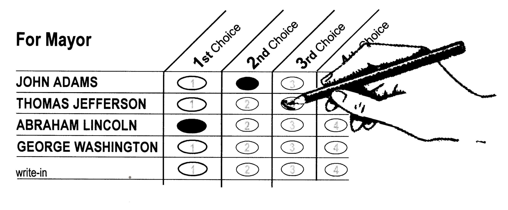

Real Time Ranked Choice Voting

Authors: Forrest Cinelli, Frank Egan, Tyle Jaskoviak, Holly Nguyen, Cory Tapply, Hope Wallace

CS 4241 Webware 

### Proposal

We propose a web application that will allow users to create, share and vote in polls where ranked choice ballots are used. Ranked Choice ballots may be familiar to anyone who has ever voted before, but with some key differences. Instead of a list of candidates or options from which you must select only one, ranked choice voting allows voters to rank as many candidates or options as they please. Ranked Choice Voting has many benefits over traditional winner-takes-all voting methods such as decreasing polarization, limiting tyranny of the majority and better supporting smaller voices, and providing a more inclusive spectrum of results ([wiki](https://en.wikipedia.org/wiki/Instant-runoff_voting)). This web app has more applications than just voting for candidates and can be used for other polls when ranking and eliminating options, such as choosing a dinner option or determining what event to go to. 

### Feature List

* Backend Database provided Firebase?

* Link to Facebook account

* Create Polls

    * Choose how many winners there can be

    * Multiple questions

    * Set time limit on voting

* Share Polls

* Vote in Polls

* Real-time visualization once you vote 

### How Does RCV Work ([YouTube](https://www.youtube.com/watch?v=l8XOZJkozfI))

#### Flow Chart for RCV

#### Example of a Ranked Choice Ballot

### How Does Our WebApp Work

Users create polls where they get to choose the number of winners, maybe there is only one winning option for where you and your friends go to dinner, but there may be multiple winning books for a book club’s annual reading list. From their voters would rank their prefered choices, leaving any they don’t care for unranked which will count as no vote. After some number of votes or some amount of time the poll will close and the host can decide the winners.

